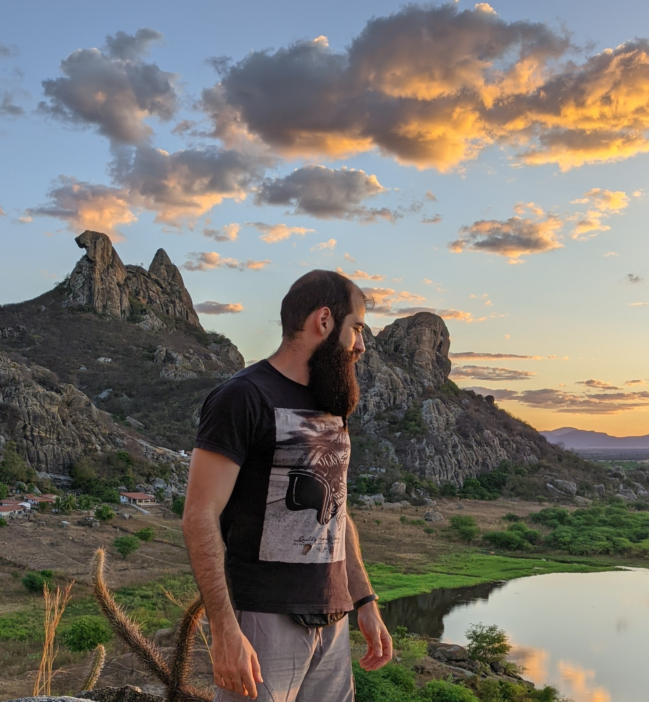

### Hi there 👋

I'm Diego! A problem solver, aspiring entrepreneur!

- 💻 Currently learning new Salesforce-related technologies through the [OSF Academy Program](https://osf.academy/sfdc-developer).
- 📱 Working on my first mobile app: [SpotHoles](https://github.com/DiFeitoza/spotholes)!
- 🌱 In the last semester of my degree in Software Engineering at Universidade Federal do Ceará - Quixadá (Brazil).
- 😅 Fun fact: Despite my affinity with logic, I am a person who really enjoys physical activities and contact with nature.
- 🏃‍♀️🧗‍♂️🌵🐍🍃🌄⛺ I'm almost a natural athlete programmer who is learning to play the guitar and sing.

